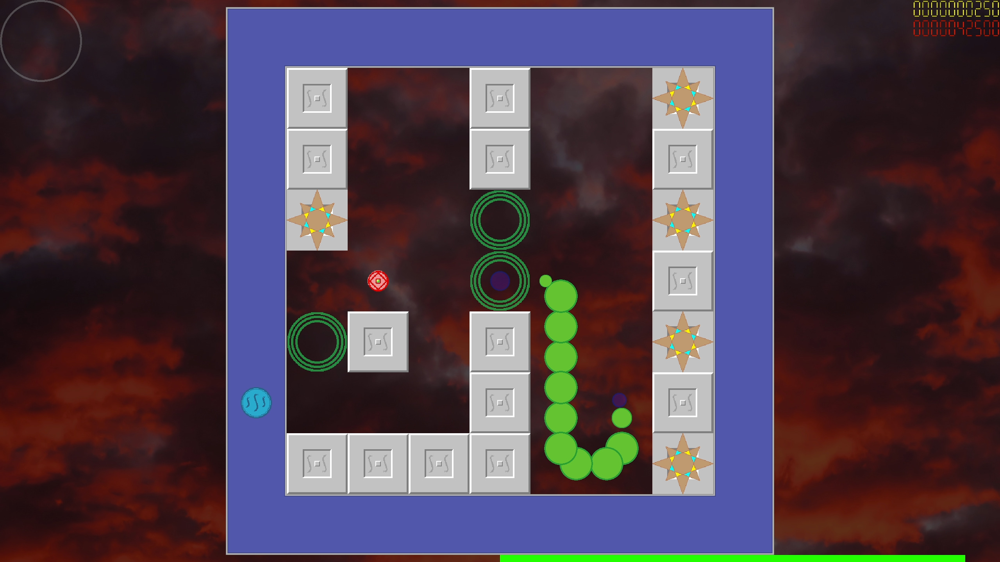
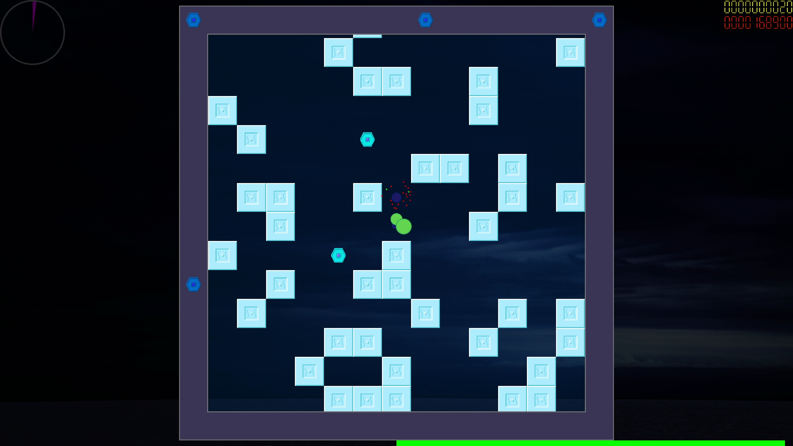
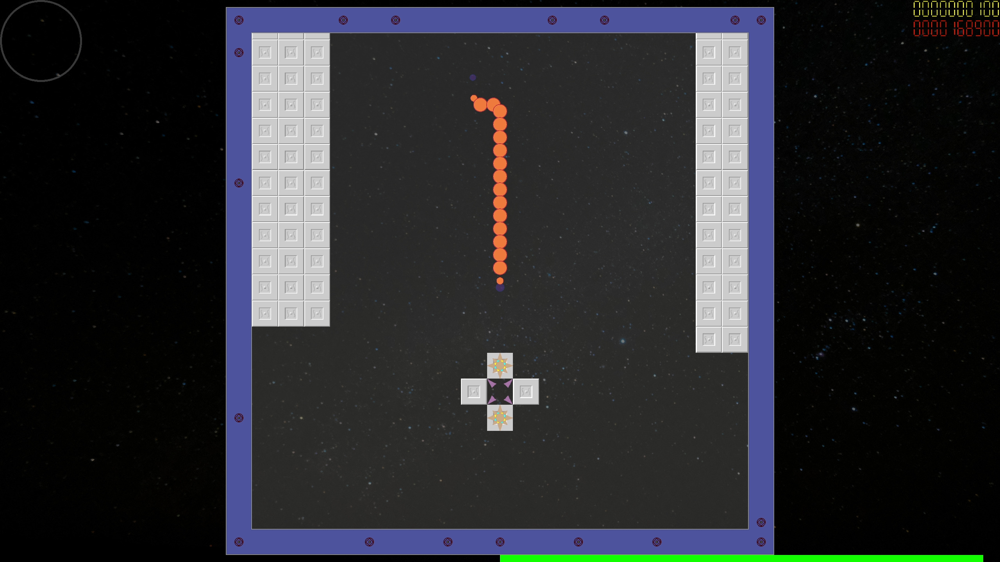

# BulletWorm

## Requirements

- [ ] **GNU/Linux** or **x64 Windows**

## Installation on Linux

- [ ] Check if *wget*, *unzip*, *git* and *g++* are available

- [ ] [Install the listed libraries](https://www.sfml-dev.org/tutorials/2.6/compile-with-cmake.php#installing-dependencies)

For example, on Debian 13 I had to install <kbd>libfreetype-dev libx11-dev libxrandr-dev libudev-dev libopengl-dev libflac-dev libvorbis-dev libopenal-dev libxcursor-dev libvulkan-dev libgl-dev</kbd>

- [ ] Run:

<kbd>./compile.sh</kbd>
<kbd>./bulletworm</kbd>

## Installation on Windows

- [ ] Download SFML 2.6 and put all extracted contents in *C:/SFML2/*

- [ ] Open the *.slnx* file in Visual Studio

- [ ] Switch to *Release* mode

- [ ] Press *Run without debugger*

- [ ] Ignore all errors and open *x64/Release/* in a file manager

- [ ] Copy dll files from *C:/SFML2/bin/* to *x64/Release/*

- [ ] Run the application in *x64/Release*

## Screenshots

