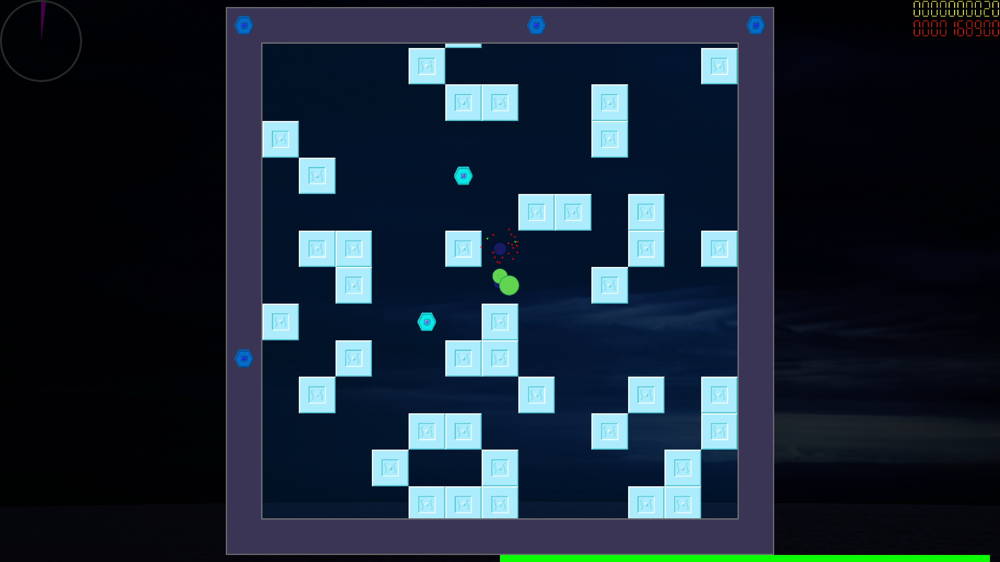

# BulletWorm

## Installation on Linux

To install the app on Linux via terminal, execute the following commands with <kbd>pwd</kbd> set to the main directory. Make sure you have [SFML](http://sfml-dev.org) 2.6.1 installed.

<kbd>$ time g++ src/\*.cpp src/engine/\*.c\* lib/src/bw_ext/\*.c\* lib/src/bw_ext/random/\*.c\* lib/src/bw_ext/stream/\*.c\* -o bulletworm -O3 -flto -march=native -pipe -W -std=c++17 -I lib/include/ -lsfml-system -lsfml-window -lsfml-graphics -lsfml-audio
</kbd> to compile and link

<kbd>$ ./bulletworm</kbd> to play

## Screenshots

